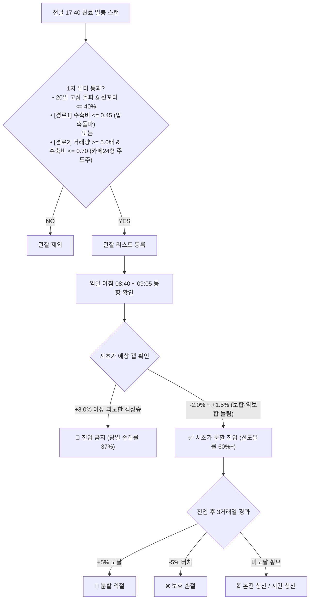

## 📈 주식 전략 관찰

<!-- DUAL_FORWARD:START -->
### 🌐 시장 상황

> 🟢 관찰 가능 · 시장 폭(SMA60) **88.7%** · 기준 완료 일봉 `2026-10-02`

### 상승초입 3일 이내

> 갱신: `2026-10-02 23:57 KST` · 기준 완료 일봉: `2026-10-02`

| 순위 | 종목 | 연속 포착 | 평가일 종가 | 상대점수 | 수치 근거 |
|---:|:---|---:|---:|---:|:---|
| 1 | 뉴로메카 (`348340`) | 1거래일째 | 22,300원 | 0.437 | [압축돌파] 수축비 0.41 · 윗꼬리 8.9% · 당일 1.73x · CMF20 +0.09 |
| 2 | 에코프로머티 (`450080`) | 1거래일째 | 38,000원 | 0.271 | [압축돌파] 수축비 0.32 · 윗꼬리 40.0% · 5일 1.55x · CMF20 +0.03 |

### 상승 초입

> 갱신: `2026-10-02 23:57 KST` · 기준 완료 일봉: `2026-10-02`

| 순위 | 종목 | 연속 포착 | 평가일 종가 | 상대점수 | 수치 근거 |
|---:|:---|---:|---:|---:|:---|
| 1 | 서진시스템 (`178320`) | 1거래일째 | 41,500원 | 0.783 | 20일 변동폭 22.2% · 5일 2.29x · CMF20 +0.03 |
| 2 | 에코프로머티 (`450080`) | 1거래일째 | 38,000원 | 0.617 | 20일 변동폭 11.6% · 5일 1.55x · CMF20 +0.03 |
| 3 | 뉴로메카 (`348340`) | 1거래일째 | 22,300원 | 0.600 | 20일 변동폭 23.7% · 당일 1.73x (5일 0.89x) · CMF20 +0.09 |
<!-- DUAL_FORWARD:END -->
<!-- QUANT_DASHBOARD:START -->

> ⏱️ 수집 실행: `2026-10-06 15:14 KST`

### 🎯 스마트 랭킹 · 금일 신규 포착

> 갱신: `2026-10-06 15:14 KST` · 신규 신호 기준봉은 표의 신호시각 참조

| 순위 | 종목(코드) | 돌파모드 | 현재가 | 돌파이격 (판정) | 거래대금 · VR | 신호시각 | 스마트점수 |
|:---:|:---|:---:|:---:|:---:|:---:|:---:|:---:|
| 🥇 1위 | **포스코퓨처엠** (003670) | ⚡ 조기(10m) | 204,500원 | -0.71% (턱걸이⚠️) | 76.0억 (2.3x) | 10-06 14:00 | 76.2점 |
| 🥈 2위 | **미래에셋생명** (085620) | ⚡ 조기(30m) | 20,450원 | +0.25% (턱걸이⚠️) | 5.5억 (2.3x) | 10-06 14:00 | 50.3점 |
| 🥉 3위 | **오스코텍** (039200) | 🟢 확정(60m) | 39,100원 | +0.65% (턱걸이⚠️) | 13.1억 (1.6x) | 10-06 14:00 | 39.8점 |

---

### 🧭 LRM-60 v2.0 · 4대 게이트 / 3슬롯

> 갱신: `2026-10-06 15:14 KST`

> **기준 완료봉:** `10-06 14:00 KST` · **4대 게이트 통과:** `0건` · **다음 봉 시가 대기:** `0건` · **가상 보유:** `2/3` · **가상 순자산:** `1,060,908원`

> 게이트별 통과: 정배열 `187` · 직전 20봉 돌파 `12` · 10억/2.5배 `27` · CLI/D_base `45` (평가 가능 `350`종목, 봉 결측 `0`종목)

| 상태 | 종목 | 신호봉 종가 | 거래대금 | 상대 대금 | D_base | 다음 단계 |
|:---:|:---|---:|---:|---:|---:|:---|
| 통과 없음 | - | - | - | - | - | 다음 완료봉 대기 |

**가상 보유 슬롯**

| 종목 | 가상 진입가 | 구조 손절선 | 목표가 | 보유 완료봉 |
|:---|---:|---:|---:|---:|
| 코스모신소재 (005070) | 46,870원 | 44,995원 | 50,620원 | 11 |
| SK가스 (018670) | 257,886원 | 247,571원 | 278,517원 | 5 |

> 신호는 완료봉 기준 관측값입니다. 체결·순자산은 가상 계산이며 실제 주문이나 수익 보장이 아닙니다. 15:00 봉 누락·무거래·데이터 지연은 별도 확인하세요.

---

### 🧪 백테스트 후속안 · 분리 가상 계좌

> 손절 버퍼 3% · +5% 1/2 분할 익절(잔여 +8%) · 전일 확정 지수 종가 > 20일 평균
> 지수 국면: KOSPI 통과 · KOSDAQ 통과 · 대기 0건 · 보유 3/3 · 가상 순자산 1,053,246원

> 아직 재백테스트·전진 검증되지 않은 가설입니다. 공식 v2.0과 성과를 합산하지 않습니다.

---

### 📌 상세 정보

> 감시 유니버스 `350종목` · 기존 패턴 포착 `3건` · 기존 활성 추적 `10건`


<!-- QUANT_DASHBOARD:END -->

## 📌 항목별 요약

- **시장 상황:** 완료 일봉의 시장 폭(SMA60)입니다. 40% 미만이면 두 일봉 전략의 후보 선별을 중단합니다. 새 완료 일봉이 확인될 때만 갱신합니다.
- **상승초입 3일 이내·상승 초입:** 완료 일봉 기준의 상대 순위입니다. 기존 모드 2(60일 고점 추종)는 상투 매물 물림 한계로 폐기되었으며, 바닥 변동성 수축과 단기 탄력을 활용하는 **상승초입 3일 이내** 관찰 체계로 전환되었습니다. `연속 포착`은 날짜별 봉인 기록에서 같은 전략의 상위 후보로 연속 등장한 거래일 수입니다. 평가일 종가는 현재가나 실제 체결 가격이 아닙니다.
- **스마트 랭킹:** 분봉 신호의 상대 순위입니다. 표의 갱신 시각과 신호시각을 함께 확인하세요.
- **LRM-60:** 완료된 60분봉의 게이트와 별도 가상 계좌입니다. 수집 시각과 기준 완료봉은 다를 수 있습니다.

자세한 수집·추적 이력은 [Quant Collector](quant-collector/README.md)에서 확인할 수 있습니다.

---

## 🔎 상승초입 3일 이내 관찰 가이드 (모드 2 폐기 및 대체)

기존 모드 2(60일 폭등 모멘텀 추종)는 진입 시점의 상투 물림 리스크로 인해 공식 폐기되었습니다. 이를 대체하는 **상승초입 3일 이내** 프로토콜은, **변동성 수축(VCP) 바닥 돌파 종목을 전날 선별하고 익일 아침 동향(시초가 갭)을 확인하여 3거래일 이내에 승부를 보는 운영 프로토콜**입니다. 실제 주문은 일절 발생하지 않는 순수 분석·관찰 가이드입니다.



### 🧭 3단계 핵심 알고리즘 수칙

1. **전날 17:40 완료 일봉 스캔 (하이브리드 듀얼 게이트)**
   - **공통 필수 안전 필터:** 종가 ≥ 직전 20일 최고가 돌파, 종가 > 20·60일 이평선, 윗꼬리 비율 ≤ 40% (피뢰침 형태 배제), 60일 이격도 ≤ 1.18 (과열 방지), CMF20 ≥ -0.05.
   - **[경로 1] 조용한 압축 돌파형 (삼천당제약·고영·뉴로메카 모델):** 변동성 수축비 ≤ 0.45 + 거래량 1.2~1.35배 이상. 바닥 에너지가 극대로 압축된 후 첫 발사.
   - **[경로 2] 주도주 거래량 점화형 (카페24 모델):** 당일 거래량 ≥ 5.0배 이상 대폭발 + 수축비 ≤ 0.70. 시장의 강력한 자금이 유입되며 박스를 찢는 대장주.
2. **익일 아침 08:40 ~ 09:05 동향 확인 (시초가 갭 필터)**
   - **🚫 과도한 갭상승 (> +3.0%):** 진입 금지. 주도주라도 시초가 과열 갭이 뜨면 당일 장중 −5% 손절률이 37.3%로 치솟으므로 추격 매수를 원천 차단합니다.
   - **✅ 보합·약보합 눌림목 (−2.0% ~ +1.5%):** 최적의 스위트스팟. 당일 손절률은 6.4%로 급감하고 손절 전 +5% 목표 선도달률은 60% 이상으로 극대화됩니다.
3. **3일 승부 원칙 (Velocity & Time-Stop)**
   - 전체 익절(+5%) 및 손절(-5%)의 **약 80%가 진입 후 3거래일 이내에 발생**합니다.
   - 3거래일 경과 후에도 목표가에 도달하지 못하고 지지부진하게 횡보할 경우, 모멘텀 소멸로 판단하여 **시간 청산(본전 청산)**으로 기회비용을 방어합니다.

---

### 📡 전진 관찰 및 재현 도구

- [병렬 전진 관찰 GitHub Actions](.github/workflows/early-inception-forward.yml): 평일 17:40 KST에 완료 일봉을 재확인하고 상위 후보를 날짜별로 봉인합니다. 결과는 `quant-research/data/research/T-110/`에 보존됩니다.
- **T-095 탐색기**: 저장된 완료 일봉의 일일 가상 판정과 RAG 근거를 표시합니다.
- **T-096 봉인 저널**: 탐색 결과와 가격·코드의 SHA-256을 기록하여 재실행 멱등성을 보장합니다.

```powershell
python -B quant-research/scripts/pure_quant_portfolio_manager.py explore
python -B quant-research/research/forward_decision_journal.py          # 쓰기 없는 준비 상태 확인
python -B quant-research/research/forward_decision_journal.py --capture # 신선한 완료 일봉이 있을 때 기록
```

가격 이력과 EPS 캐시는 각 로컬 데이터 원본이 필요합니다. T-096의 준비 상태 명령으로 매번 최신 일봉의 신선도를 확인하세요. GitHub Actions의 일봉 패널은 별도의 공개 시세 수신 결과를 사용하며 EPS 캐시나 SUE 점수를 사용하지 않습니다.

---

# 📦 Leobox Multi-root Workspace

Gemini(Antigravity), Claude(Claude Code), OpenAI Codex / Copilot이 유기적으로 협업하는 멀티 루트 워크스페이스입니다.

---

## 📁 구성 서브 프로젝트

| 폴더 | 표시 이름 | 용도 및 규칙 |
| :--- | :--- | :--- |
| [`quant-research/`](quant-research/README.md) | **📈 Quant Research** | 퀀트 알고리즘 연구, 시계열 분석, 백테스팅 ([`AGENTS.md`](quant-research/AGENTS.md)) |
| [`quant-collector/`](quant-collector/README.md) | **⏱️ Quant Collector** | 15분 간격 GitHub Actions 자동 수집 및 모바일 수동 실행 ([`AGENTS.md`](quant-collector/AGENTS.md)) |
| [`gym-app/`](gym-app/README.md) | **🏋️ Gym App** | 오프라인 퍼스트 안드로이드 헬스 기록 앱 ([`AGENTS.md`](gym-app/AGENTS.md)) |

---

## 🤖 멀티 에이전트 협업 체계 (Gemini + Claude + Codex)

- **공통 골든 룰**: [`AGENTS.md`](AGENTS.md)
- **Claude Code 엔트리**: [`CLAUDE.md`](CLAUDE.md)
- **Antigravity(Gemini) 엔트리**: [`GEMINI.md`](GEMINI.md)
- **전문 스킬 (Skills)**:
  - [`backlog-manager`](.agents/skills/backlog-manager/SKILL.md) : 백로그 조회 및 상태 변경 CLI 제어
  - [`adversarial-reviewer`](.agents/skills/adversarial-reviewer/SKILL.md) : 완료 전 적대적 코드 결함 감사
  - [`quant-backtest-validator`](.agents/skills/quant-backtest-validator/SKILL.md) : 미래 데이터 누수(Lookahead Bias) 및 과적합 검증
  - [`collector-safety-check`](.agents/skills/collector-safety-check/SKILL.md) : 자동 매수/주문 로직 차단 및 멱등성 검사
  - [`offline-first-reviewer`](.agents/skills/offline-first-reviewer/SKILL.md) : 오프라인 저장 및 운동 UI 사용성 검증

---

## 📋 백로그 관리 (CLI 기반 SSOT)

`backlog.json`은 직접 수정하지 않고 반드시 CLI 도구를 사용합니다:

```bash
# 1. 지금 바로 착수 가능한 작업 확인
node tools/backlog.mjs next

# 2. 작업 착수 (코드 수정 전 필수!)
node tools/backlog.mjs set <id> in_progress

# 3. 작업 완료 처리
node tools/backlog.mjs set <id> done

# 4. 판단/대기 상태 기록 (사유 필수)
node tools/backlog.mjs set <id> needs_decision --note "결정 필요 사유"

# 5. 작업 통계 및 무결성 검증
node tools/backlog.mjs stats
node tools/backlog.mjs check
```

---

## 📊 PostgreSQL & Grafana 모니터링 대시보드

백로그 현황을 시각화하고 진행 이력을 추적할 수 있는 하이브리드 대시보드 환경입니다.

### 1. 인프라 실행 (Docker Desktop 실행 후)
```bash
cd infra/monitoring
docker compose up -d
```
- **Grafana 웹 접속**: `http://localhost:3000` (ID: `admin` / PW: `admin`)
- 사전 구성된 **Leobox Multi-root Backlog Overview** 대시보드가 자동 로드됩니다.

### 2. 백로그 데이터베이스 동기화
```bash
# 백로그 변경 후 DB에 즉시 반영
node tools/backlog.mjs sync-db
```

---

## 🚀 멀티 루트 워크스페이스 열기

1. **Antigravity IDE / VS Code 실행**
2. **`File (파일)`** → **`Open Workspace from File... (파일에서 작업 영역 열기...)`** 클릭
3. [`leobox.code-workspace`](leobox.code-workspace) 선택
